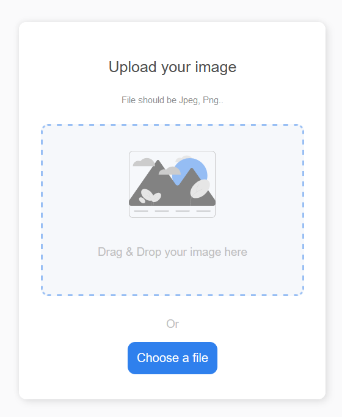

# ImageUploader

This project was generated with [Angular CLI](https://github.com/angular/angular-cli) version 12.2.2.

## To run the project locally, first install all dependencies using
`npm install`

## Development server

Run `ng serve` for a dev server. Navigate to `http://localhost:4200/`. The app will automatically reload if you change any of the source files.

## Screenshots of the Uploader
1. Upload Multiple Images

2. Loading Bar

3. Uploaded Successfully
